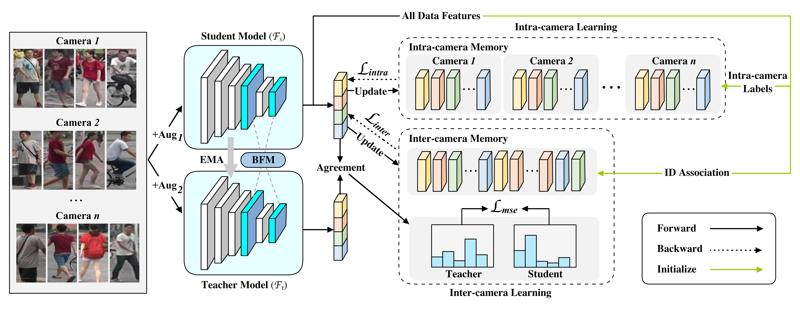
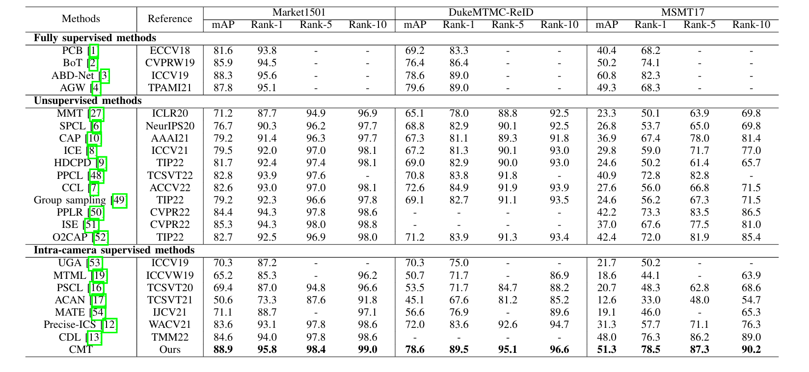

# Contrastive Mean Teacher for Intra-camera Supervised Person Re-Identification

Official implementation of paper [Contrastive Mean Teacher for Intra-camera Supervised Person Re-Identification](https://ieeexplore.ieee.org/document/10534060) (TCSVT 2024).

## Updates
- 2024/06 The code will be released soon.
- 2024/05/17 CMT for ICS-ReID is accepted by TCSVT2024! 🎉🎉
- 
## Overview



### Preparation

**Requirements: Pytorch>=1.1.0 and python>=3.6**

1. install [pytorch](https://pytorch.org/)
2. Download re-ID dataset 
   - [Market-1501](https://drive.google.com/file/d/0B8-rUzbwVRk0c054eEozWG9COHM/view)
   - [DukeMTMC-reID](https://drive.google.com/file/d/1jjE85dRCMOgRtvJ5RQV9-Afs-2_5dY3O/view)
   - [MSMT17](https://arxiv.org/abs/1711.08565)
3. Put the data under the dataset directory. Training, query and test sub-folder should named as bounding_box_train, query, bounding_box_test, respectively.

### Training

Download the datasets and put them into the right place.
Check and run the shell script `train.sh`:

```bash
CUDA_VISIBLE_DEVICES=0 ./train.sh # run on GPU 0
```

### Evaluation

You can run evaluation on any datasets with model weight provided.

```bash
CUDA_VISIBLE_DEVICES=0 python evaluate.py --weight /path/to/model/weight.pth # run on GPU 0
```

## Performance



## Acknowledgement

We would like to sincerely thank [Precise-ICS](https://github.com/Terminator8758/Precise-ICS-master), [CCL](https://github.com/alibaba/cluster-contrast-reid) and [MeanTeacher](https://github.com/CuriousAI/mean-teacher) for their insightful ideas and outstanding works!

## Citation

If you feel our work helpful in your research, please cite it like this:

```bibtex
@ARTICLE{10534060,
  author={Gong, Xun and Tan, Xuan and Xiang, Yang},
  journal={IEEE Transactions on Circuits and Systems for Video Technology}, 
  title={Contrastive Mean Teacher for Intra-camera Supervised Person Re-Identification}, 
  year={2024},
  volume={},
  number={},
  pages={1-1},
  keywords={Cameras;Pedestrians;Training;Feature extraction;Computational modeling;Lighting;Data models;Intra-camera supervision;Mean Teacher;Contrastive learning;Person re-identification},
  doi={10.1109/TCSVT.2024.3402533}}
```
